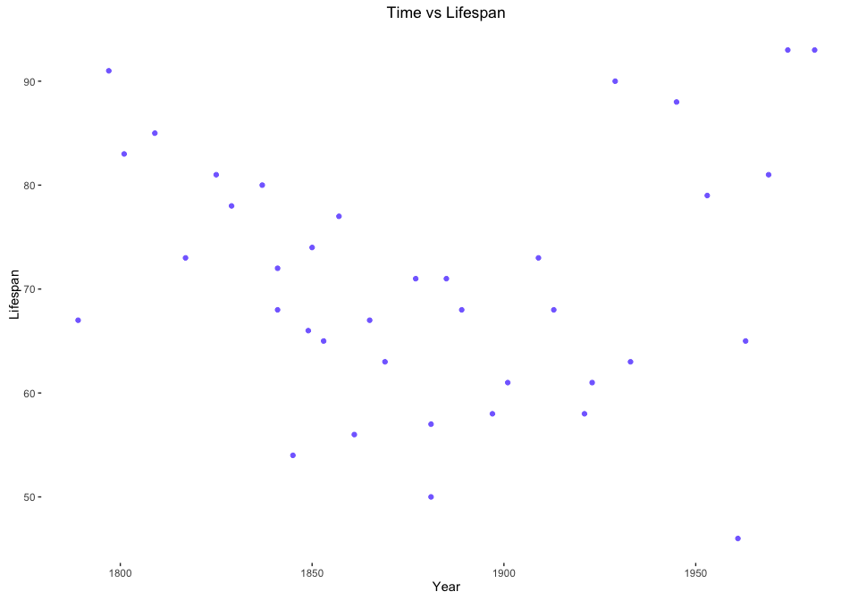
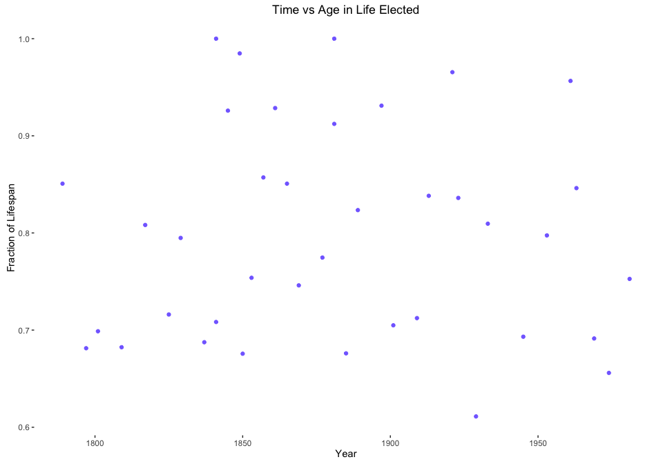
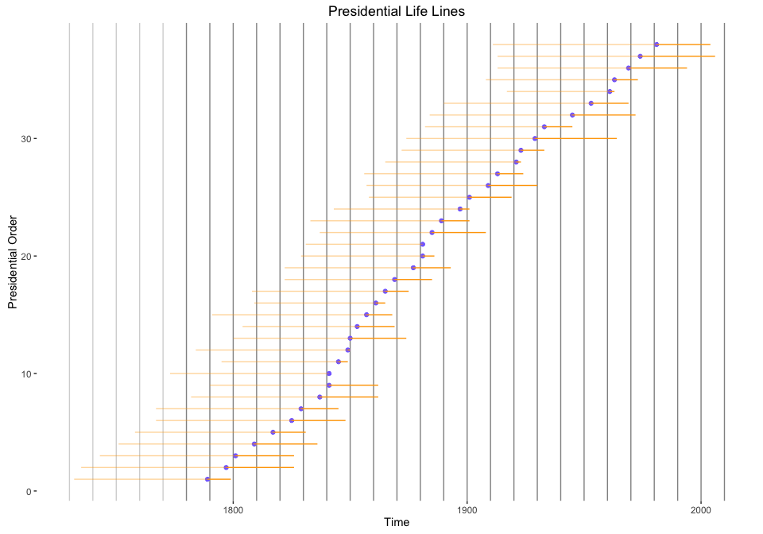
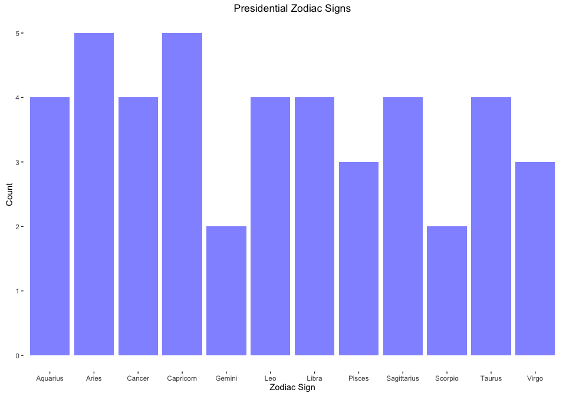

Graphing US Presidents
================

 

### Inspiration for the project

While browsing Reddit's [r/dataisbeautiful](https://www.reddit.com/r/dataisbeautiful/), I noticed that the user u/melkovar had [graphed](https://www.reddit.com/r/dataisbeautiful/comments/6zy8o9/oc_number_of_us_presidents_alive_at_the_start_of/) the number of US presidents alive at the beginning of each decade. It was an interesting graph, but didn't have much information besides just the graph. I was curious to play with the dataset a bit and see what I could come up with. I followed the link to the data, scraped it, and began exploring it.

 

### Potentially Interesting Metrics

From the data I found, I acquired:

-   Birth Year
-   First Elected
-   Death Year

Here's a sample:

 

    ##           President BirthYear FirstElected DeathYear
    ## 1 George Washington      1732         1789      1799
    ## 2        John Adams      1735         1797      1826
    ## 3  Thomas Jefferson      1743         1801      1826
    ## 4     James Madison      1751         1809      1836
    ## 5      James Monroe      1758         1817      1831
    ## 6 John Quincy Adams      1767         1825      1848

 

From this data, I calculated:

-   Age at Death
-   Age when First Elected
-   Years between First Election and Death

 

    ##           President Lifespan ElectedAge RemainingYears
    ## 1 George Washington       67         57             10
    ## 2        John Adams       91         62             29
    ## 3  Thomas Jefferson       83         58             25
    ## 4     James Madison       85         58             27
    ## 5      James Monroe       73         59             14
    ## 6 John Quincy Adams       81         58             23

 

As I began graphing things, I realized it could be nice to have some more data along with it. I explored:

-   Presidents alive at the end of each decade.
-   Number of terms presidents held.

 

### Graphs and Interpretations

##### Once I got a few dataframes to play with, I started coming up with a list of questions, and their

##### expected outcome. Then I started throwing together some graphs.

 

**Time vs Lifespan** : My expected outcome was for lifetime to increase over time, but it's fairly scattered. This could be from not enough data to see a general trend.

It turns out two things are at play here. First, infant mortality rates have gone down significantly over the last 150 years (or at least in England), converging with the general population. Second, life expectancy for the general population (older than 5 years old) has also increased over the last 150 years. This information comes from the great resource [Our World In Data](https://ourworldindata.org/life-expectancy/).

 

 

Why do the presidents not follow this trend? Even presidents have to follow the law. One hypothesis is that presidents are not a good sample of the general population. They are (with few exceptions), rich, old, white men. As we see in the above graph, life expectancy hasn't changed much once you've made it to 50+ years old.

 

**Time vs Age in Life Elected** : My expected outcome was for presidents to be elected later in their lifetime before the modern era, because now it's easier to become famous overnight. Before mass media, becoming a household name would require much more time and effort, and a longer career in politics. However, there's no trend here, it's scattered all over the place. We can see some of the assassinated presidents high up on the graph.

 

**Age Elected vs Lifespan** : My expected outcome was to for elected age to increase as lifespan increased, since people would wait until they were older to run for office. If you thought you were going to die at 50 years old, you would run at 35, not 45. There is a significant correlation here, albeit a weak one (Adjusted *R*2 = 0.357).

 

**Number of Presidents Alive Over Time** : My expected outcome was for the graph to be same as seen on Reddit, and we find it to be the same as Reddit! My initial expectation was that life expectancy would play a significant role, but we've learned this isn't the case. My next expectation was that term limits would play a significant role. During the period between 1820-1900, the vast majority of presidents only served a single term, which generated a lot of presidents/former-presidents that would survive for the next couple decades. On the other end of the spectrum, I speculated that FDR's 12 year tenure would starve the number of new presidents being crowned and cause the number of presidents to drop.

I was wrong, as illustrated by this next graph of the presidential life lines.

 

**Presidential Life Lines** : The average president only lives for 15 years after leaving office, but the average president also lived 56 years before being elected. The average presidential lifespan of 71 is very long compared to even the longest of presidential terms.

Also of note (in the former bar graph), the recent decline in alive presidents is not due to a sudden die-off, but rather is not compensating for any future presidents. Without the next ten or so presidents being included in the "alive" category, the most recent bars are substantially lower.

 

**Presidential Zodiac Signs** : Just for good measure, I calculated the presidents' zodiac signs to see if there were any patterns. After much graphing and many regressions, I have to report no causal relationship between zodiac signs and anything else.

 

### Concluding

Going into this project, I expected to find exciting, strong trends among the presidents over time. However, the presidential timelines appear to be quite robust and resistant to dividing and interpreting without adding additional variables.

 
